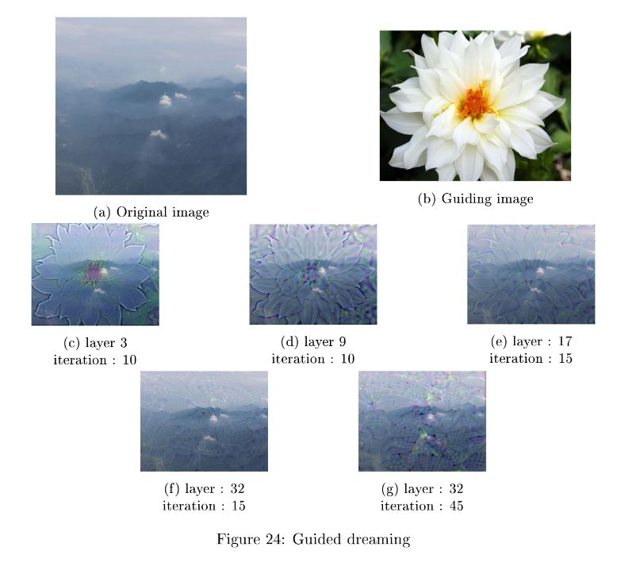
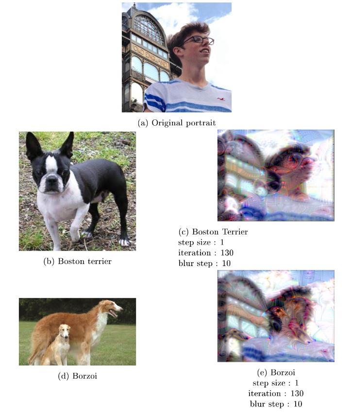

[Deep Learning](http://www.math.ens-cachan.fr/version-francaise/formations/master-mva/contenus-/introduction-to-deep-learning-165822.kjsp?RH=1242430202531)
================

Computer vision final project with initial code by Iasonas Kokkinos.

Several experiments with feature visualization (sometimes known as "deep dream")

All details about this project can be found in my [report](report-dl.pdf)

## Results

Some figures from my report to get a firt idea of the project

### Guided dreaming

Modify a given layer's activations to match the same activations as another image.

### Adverserial examples

Modify an image to change it's output class

