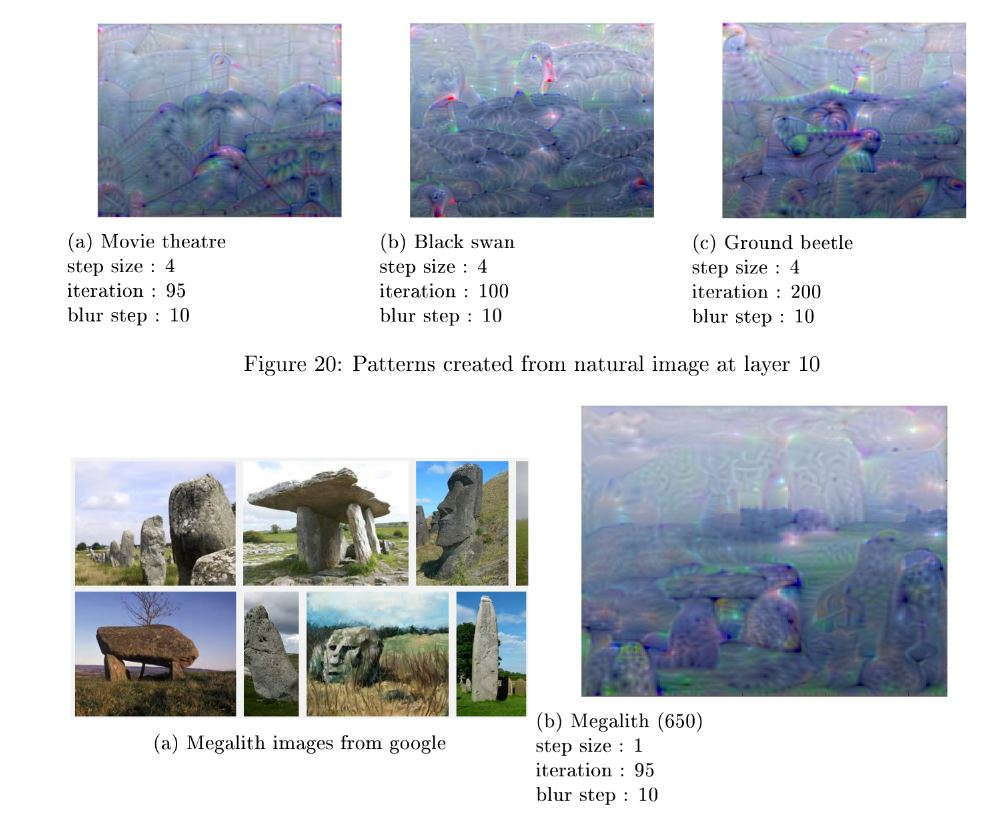

f[Deep Learning](http://www.math.ens-cachan.fr/version-francaise/formations/master-mva/contenus-/introduction-to-deep-learning-165822.kjsp?RH=1242430202531)
================

Computer vision final project with initial code by Iasonas Kokkinos.

Several experiments with feature visualization (sometimes known as "deep dream")

All details about this project can be found in my [report](report-dl.pdf)

## Results

Some figures from my report to get a first idea of the project

### Guided dreaming

In this case, I tried to change an original image so that it produces the same activations in a given layer of a neural network as another image.

### Adverserial examples

How much do we have to change the colors of the pixels of a dog image to make the algorithm think that it is a tree ? Not much ! 

We can also keep modifying the image to make patterns of a class appear in the new image. 

Modify an image to change it's output class

Here, a photo of a dog on which I enhanced patterns of two different dog breads.

And here, the "hallucinations" of megalith in a simple image.

