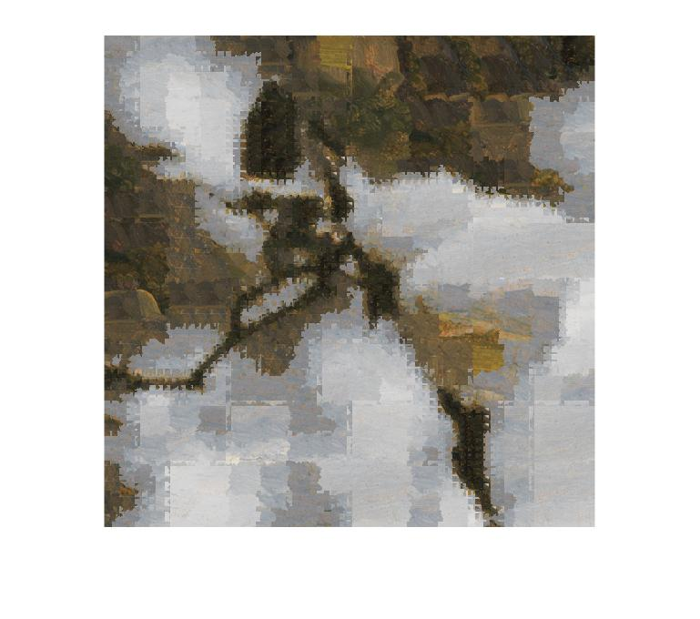
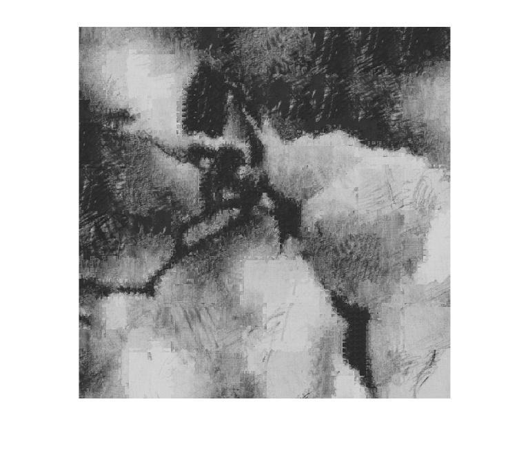
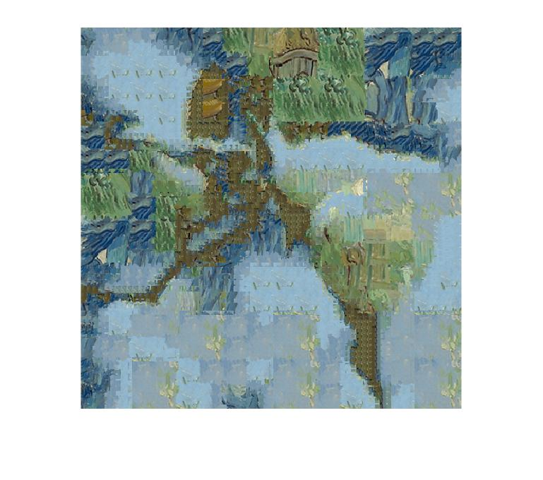
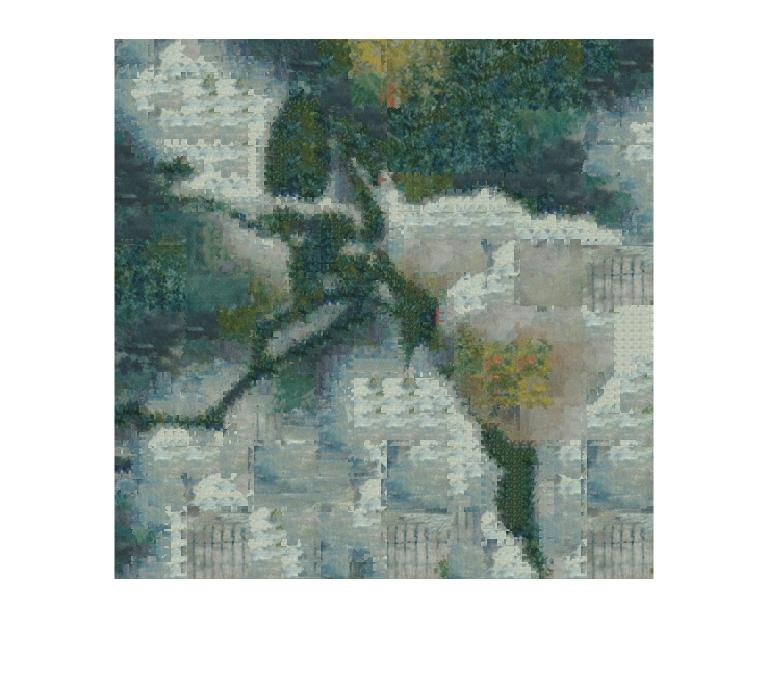

Quadtree based style transfer
=============================

An implementation of adaptative size image quilting mostly based on [Split and Match: Example-based Adaptive Patch Sampling for Unsupervised Style Transfer](http://oriel.github.io/style_transfer.html) 

The general idea is to cut the style image in patches of various sizes and map them to a content image by taking both into account the local variability of the content image and the proximity to the best match of the potential matches from the style images.

[demo.m](demo.m) is the place to start to look at a specific example

[main.m](main.m) is the place to see many more examples

And you can see the PdF report [here](yana-hasson-final-report.pdf)

# Some results

## Initial content image

## Results

   

